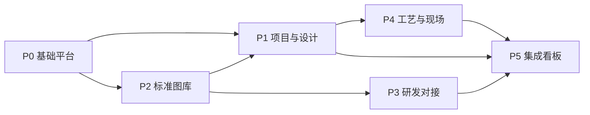

# 热流道技术管理端 — 开发计划

**文档版本**：v1.1（与《架构设计》对齐：后端 Python）  
**关联文档**：《技术管理端-业务需求规格说明书.md》《技术管理端-架构设计文档.md》

---

## 1. 计划目标

- 在可控迭代内交付**可试运行的管理端 MVP**，覆盖「组织权限 + 项目上下文 + 标准图库基础 + 设计任务与选型存根 + 工单闭环雏形 + 核心审批流」。
- 后续按业务价值递增扩展 **ERP/MES 深度集成、智能校验、全文检索、图纸高级预览**。

---

## 2. 阶段划分总览

| 阶段 | 周期（建议） | 目标产出 |
|------|----------------|----------|
| P0 基础平台 | 4–6 周 | 组织/岗位/角色、登录鉴权、审计、文件上传、基础 UI 框架 |
| P1 项目与设计主线 | 6–8 周 | 技术项目、任务、里程碑、设计任务、变更单、选型存根与项目绑定 |
| P2 标准化与图库 | 6–8 周 | 标准件、图纸版本、分类标签、入库/淘汰审批、发布锁定 |
| P3 研发与成果对接 | 4–6 周 | 研发项目、版本迭代审批、成果入库申请与图库流程衔接 |
| P4 工艺与现场 | 6–8 周 | 工艺方案与图纸绑定、试模/售后工单、报告与多媒体、闭环 |
| P5 集成与看板 | 6–10 周 | ERP/MES 同步、选型/复用率/工单类看板、技术总监驾驶舱 |
| P6 增强与优化 | 持续 | 合规校验规则引擎增强、检索、性能与安全加固 |

> 周期为**单团队约 4–8 名研发**的粗估，需根据实际人力与对接系统调整。

---

## 3. 各阶段工作包（WBS）

### 3.1 P0 基础平台

| 工作项 | 交付物 | 备注 |
|--------|--------|------|
| 工程脚手架与规范 | 前后端仓库、CI、代码规范 | 前端 React+Antd；后端 **Python**（FastAPI 或 Django）；含环境分层 dev/stage/prod |
| 组织与人员 | 部门树、人员、岗位 | 与角色映射预留 |
| RBAC | 角色、菜单、API 权限 | 数据范围先做「项目成员」模型 |
| 文件服务 | 上传、分片、对象存储 | 元数据表 |
| 审计日志 | 登录与关键操作 | 可查询导出权限控制 |
| 通知骨架 | 站内消息 + 邮件/企微占位 | 后续接真实通道 |

**里程碑 M0**：可演示的后台框架 + 权限演示账号体系。

---

### 3.2 P1 项目与设计主线

| 工作项 | 交付物 |
|--------|--------|
| 技术项目 CRUD | 项目档案、状态、成员 |
| WBS 与任务 | 任务拆解、负责人、截止日期 |
| 里程碑与风险 | 风险登记、简单预警（逾期高亮） |
| 设计任务 | 分配、进度更新、负载列表 |
| 设计变更流程 | 申请—审批—实施—关闭（可先简化） |
| 选型存根 | 选型会话记录、与项目绑定、导出 PDF/Excel（可选） |
| 智能选型 v0 | 规则配置后台 + 前端选型向导（可先规则表驱动） |

**里程碑 M1**：端到端「项目 → 设计任务 → 选型存根」演示链路。

---

### 3.3 P2 标准化与图库

| 工作项 | 交付物 |
|--------|--------|
| 标准件主数据 | 编码、分类、标签、状态 |
| 图纸版本模型 | 草稿/发布/停用、版本链 |
| 入库/淘汰审批 | 与工作流引擎对接 |
| 权限与分区 | 图库读写分离、下载策略 |
| 合规校验 v0 | 元数据必填、命名规范、文件类型白名单 |

**里程碑 M2**：标准件发布可被设计模块引用且版本不可篡改（新迭代走新版本）。

---

### 3.4 P3 研发与成果对接

| 工作项 | 交付物 |
|--------|--------|
| 研发项目与任务 | 与 PMO 项目关联或子项目模型（需产品定稿） |
| 版本迭代审批 | 与研发分支/发布说明字段绑定（可简化为表单） |
| 仿真/成果附件 | 分类存档、标签检索（可先列表） |
| 成果入库申请 | 触发标准库入库审批流 |

**里程碑 M3**：研发成果可进入标准库审批闭环。

---

### 3.5 P4 工艺与现场

| 工作项 | 交付物 |
|--------|--------|
| 工艺方案与绑定 | 工艺文件与零件/项目关联 |
| 工艺批注 | 图层或批注记录（可分阶段：先附件+评论） |
| 试模工单 | 状态机、报告模板、附件 |
| 售后工单 | 溯源链接到项目/图纸/选型存根 |
| 知识库 v0 | 失效案例结构化字段 + 附件 |

**里程碑 M4**：工单从发起到关闭全链路可查询。

---

### 3.6 P5 集成与看板

| 工作项 | 交付物 |
|--------|--------|
| ERP 主数据同步 | 物料、单位、仓库等（范围需调研） |
| BOM 推送/拉取 | 映射表、错误重试、对账报表 |
| MES（可选） | 以企业现有接口为准 |
| 看板 | 技术总监驾驶舱 v1、模块 KPI |
| 移动端 App | 看板 + 待办审批（与 P0-P4 并行可缩短整体周期） |

**里程碑 M5**：与 ERP 联调通过试点项目。

---

### 3.7 P6 增强与优化

- 设计/工艺合规规则引擎增强、可加工性校验与设计端联动。
- 全文检索、复杂筛选保存为视图。
- 大文件预览与转码集群化、性能压测与安全渗透。

---

## 4. 跨阶段依赖关系（简图）

---

## 5. 团队与角色分工（建议）

| 角色 | 职责 |
|------|------|
| 产品经理 | 范围优先级、原型、验收标准 |
| 架构师 | 技术选型、模块边界、集成方案 |
| 后端开发 | 领域服务、工作流、集成 |
| 前端开发 | 管理端；移动端可专人或兼任 |
| 测试 | 用例、自动化接口测试、回归 |
| 实施/运维 | 环境、监控、备份 |
| 业务专家 | 标准化主管、设计/工艺代表参与 UAT |

---

## 6. 风险与应对

| 风险 | 影响 | 应对 |
|------|------|------|
| ERP/MES 接口不规范或文档缺失 | 集成延期 | P5 前安排接口调研与 PoC；先文件+手工导入兜底 |
| 图纸预览格式多 | 成本与周期 | 分阶段：先下载+元数据，后转码 |
| 规则引擎一次做太全 | 蔓延 | v0 用配置表 + 脚本表达式，预留规则 DSL |
| 权限模型过复杂 | 交付慢 | 先 RBAC + 项目成员，再扩展 ABAC |

---

## 7. 验收与发布节奏

- **迭代长度**：2 周为一迭代；每迭代末可演示。
- **UAT**：每阶段里程碑邀请业务关键用户签字确认。
- **发布**：蓝绿或滚动发布；数据库变更走迁移脚本与回滚预案。

---

## 8. 近期行动项（启动周）

1. 确认技术栈与仓库划分（单仓 mono 或多仓）。  
2. 与业务方确认 **MVP 范围**：优先「项目+设计+图库+审批」或「工单优先」。  
3. 输出接口调研清单（ERP 物料/BOM 字段映射）。  
4. 搭建 dev 环境：数据库、对象存储、CI。  

---

**文档结束**
