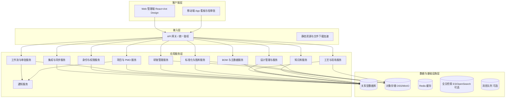
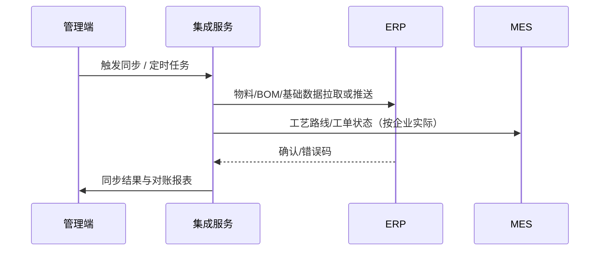

# 热流道技术管理端 — 架构设计文档

**文档版本**：v1.2（前端 React+Ant Design；后端 Python）  
**关联文档**：《技术管理端-业务需求规格说明书.md》《技术管理端-开发计划.md》

---

## 1. 设计目标

- 支撑**多模块协同**（研发、标准化、设计、工艺与现场、技术 PMO）在同一套管理端内完成流程、数据与权限的统一。
- 保证**可追溯性**：审批、版本、工单、选型存根、BOM 与项目之间的可关联查询。
- 具备与企业 **ERP/MES** 及消息平台的**可演进集成**能力。
- 满足**分级授权**（一至四级岗位）与**技术总监最终审批**等组织规则。

---

## 2. 总体架构

### 2.1 逻辑分层

### 2.2 部署形态（推荐）

- **单体模块化**或**模块化单体**起步：降低运维复杂度，通过包边界预演未来拆分。
- 文件统一走**对象存储**；异步任务（转码、同步、报表）可用队列或定时任务。
- 生产环境：**网关 + 无状态应用多实例 + 主从/高可用数据库**。

---

## 3. 技术栈建议（可替换）

| 层次 | 推荐选项 | 说明 |
|------|----------|------|
| 管理端前端 | **React 18** + **TypeScript** + **Vite** + **Ant Design 5.x**（可选 **Ant Design Pro** 做布局、权限路由与脚手架） | 与团队技术选型一致；组件与主题体系统一 |
| 移动端 | Uni-app / Flutter（二选一） | 与「APP 数据看板」诉求对齐 |
| 后端 | **Python 3.11+**，推荐 **FastAPI**（备选 **Django 5 + DRF**）；ORM 用 **SQLAlchemy 2.0** 或 **Django ORM**；迁移 **Alembic** / Django Migrations；部署 **Uvicorn** / **Gunicorn** + 反向代理；可选 **Celery + Redis** 承载转码、ERP 同步等异步任务 | 与团队技术选型一致；FastAPI 可原生产出 OpenAPI |
| API 风格 | REST + OpenAPI；必要时 WebSocket/SSE 推送通知 | |
| 鉴权 | OAuth2/OIDC 或 JWT + Refresh；RBAC + 数据范围 | |
| 工作流 | **Camunda / Flowable** 以 **REST** 与 Python 服务集成，或 **SpiffWorkflow** / 自研轻量状态机（按复杂度选型） | 审批流可配置；避免在 Python 进程内强绑 Java 引擎除非团队已有中间件 |
| 数据库 | PostgreSQL / MySQL 8 | 事务与一致性 |
| 对象存储 | MinIO / 云厂商 OSS | 图纸与报告 |
| 检索 | Elasticsearch（可选） | 知识库与全文检索 |

---

## 4. 模块划分与边界

| 模块 | 职责 | 主要对外能力 |
|------|------|----------------|
| IAM | 用户、组织、岗位、角色、数据范围、审计 | 登录、授权、租户/组织隔离（如需） |
| 工作流 | 流程定义、实例、任务、会签、超时升级 | 统一审批待办、流程编排 API |
| 项目 PMO | 项目模板、WBS、里程碑、风险、变更、统计 | 项目看板、风险预警 |
| 研发管理 | 研发项目、任务、版本迭代、成果入库对接 | 与图库/审批联动 |
| 标准化与图库 | 标准件、图纸版本、分类标签、合规校验、发布锁定 | 设计/研发侧调用标准件 |
| 设计管理 | 设计任务、方案、变更、选型工具与存根 | 绑定项目与 BOM |
| 工艺与现场 | 工艺方案、批注、试模/售后工单、闭环 | 与项目、图纸版本关联 |
| BOM 主数据 | 编码规则、BOM 生成、成本参数 | 与 ERP 同步 |
| 知识库 | 标准文档、失效案例、解决方案 | 检索与引用链接 |
| 集成 | ERP/MES/消息通道适配、幂等、补偿、对账 | 同步任务与监控 |

**边界原则**：项目为横向「上下文」，各垂直域产生的主数据通过 **project_id / entity_ref** 建立关联；避免跨模块直接访问表，优先通过应用服务 API 或领域事件（后期）。

---

## 5. 权限模型

### 5.1 RBAC + 数据范围

- **功能权限**：菜单、按钮、API Scope。
- **数据权限**（示例维度）：所属部门、参与项目、客户域、密级、标准库分区。
- **岗位映射**：组织岗位 → 系统角色（可一对多）；四级岗位可细化为「角色 + 数据范围策略」。

### 5.2 关键规则

- **技术总监**：配置为特定流程的**最终审批人**；可设代理人。
- **标准化主管 / 图库管理员**：图库写权限分级；**版本发布/停用**与普通人分离。
- **设计/研发/工艺**：按项目与任务授权临时读写范围。

---

## 6. 工作流与状态机

### 6.1 统一审批类型（示例）

- 研发立项、版本迭代发布、技术标准发布、零件入库/淘汰、设计方案、工艺方案、试模报告（如需）、重大设计变更、成果入库等。

### 6.2 工单类（试模/售后）

- 独立状态机：**新建 → 受理 → 处理中 → 待验证 → 已关闭 / 已驳回**。
- 与审批流可并存：例如「报告审核」走短流程，「整改闭环」走工单。

---

## 7. 文件与版本策略

- **存储**：元数据在业务库；文件本体在对象存储；支持分片上传与断点续传。
- **版本**：业务版本号 + 存储 key 不可变；发布态（草稿/已发布/已停用）。
- **预览**：异步转 PDF/轻量化模型（按投入分阶段）；敏感文件下载需权限 + 审计。
- **锁定**：已发布标准件版本锁定编辑；迭代通过新版本实现。

---

## 8. 集成架构（ERP / MES）

- **幂等键**：物料编码 + 变更版本 / 同步批次号。
- **失败重试**：指数退避 + 死信队列人工处理。
- **对账**：按日统计成功/失败条数与差异清单。

---

## 9. 可观测性与运维

- 日志：请求 traceId、用户、租户、关键业务单号。
- 指标：接口延迟、错误率、同步任务成功率、队列堆积。
- 配置中心：预警阈值、审批 SLA、功能开关。

---

## 10. 安全设计要点

- 传输 TLS；敏感配置密钥托管（KMS/环境注入）。
- 导出与批量下载：**二次审批或高级角色**。
- 防重放与签名：对外开放 Webhook 时启用。
- 数据备份与恢复演练策略（RPO/RTO 与业务对齐）。

---

## 11. 扩展与演进

- **领域事件**（未来）：标准件发布 → 通知设计模块刷新缓存；BOM 变更 → 触发 ERP 同步。
- **拆分时机**：当单一服务发布耦合度过高或团队规模扩大时，优先拆分 **集成服务** 与 **文件/转码服务**。

---

**文档结束**
